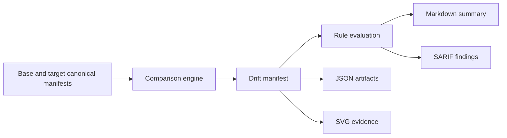
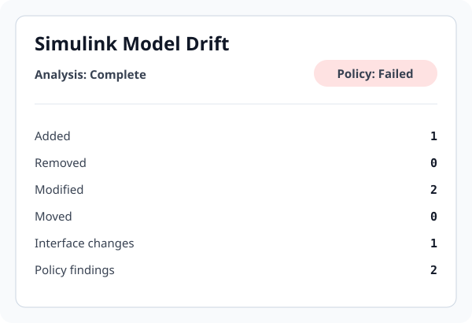

# Simulink Model Drift Analyzer

Simulink Model Drift Analyzer is a deterministic model-review tool for control, embedded, and safety-related engineering teams. It helps reviewers compare model revisions, classify drift, and enforce policy decisions in CI and pull requests without depending on GitHub-only interpretation.

## Product overview

### Value proposition

The delivered product is a reviewable, evidence-based comparison workflow for canonical Simulink model manifests. The proven path is deterministic and portable:

- compare a base model and target model in a way that outputs stable JSON and rich reviewer artifacts;
- keep the same drift facts usable in workflow automation, human review, and policy enforcement;
- expose uncertainty explicitly instead of pretending that an incomplete extraction is equivalent to a successful one.

This is a product for teams that need to review model changes before merge, not a claim that every `.slx` can be semantically interpreted by default.

### Who it's for

- controls and embedded software teams reviewing model changes across releases;
- safety, assurance, and architecture reviewers who need deterministic evidence in CI;
- engineering organizations that want a reviewable artifact trail before approving model changes;
- enterprise teams that want a supported workflow layered on top of a trusted extraction implementation.

### What it solves

- identifies added, removed, modified, and moved model elements in a review-friendly record;
- makes model drift reviewable in GitHub pull requests and CI pipelines;
- produces consistent output in JSON, Markdown, SARIF, and SVG formats;
- supports rule-based findings for interfaces, parameter changes, and policy thresholds;
- keeps the same underlying drift facts available to both automation and reviewers.

### Deployment and runner models

The repository supports two distinct deployment patterns:

1. Proven canonical path: run the public Python package or composite action on GitHub-hosted or self-hosted runners without MATLAB or Simulink installed.
2. Optional first-party MathWorks-backed path: run the checked-in static extractor in a dedicated MATLAB/Simulink environment after validating it against the project's release, licenses, dependencies, and isolation controls.

The optional path is intentionally separate. It is not bundled into the default install, and it must be paired with explicit trust review, product licensing, and runner isolation.

### Adoption workflow

1. Start with canonical JSON manifests in a CI-safe workflow.
2. Run the comparison engine to generate drift JSON and reviewer summaries.
3. Review the Markdown summary and generated SARIF findings in the pull request or workflow artifact.
4. Gate merge on configured policy thresholds when the drift is unacceptable.
5. Add a MATLAB/Simulink semantic extractor only after the runner security model, license posture, and supported API contract are approved.

### Supported release path

The supported product release path is:

- a versioned Python package with deterministic reports and schema validation;
- a root composite action for GitHub Actions workflows;
- immutable release tags and compatibility checks for action inputs/outputs and schema contracts;
- documented support boundaries, not broad after-the-fact semantic claims.

Consumers with strict supply-chain requirements should pin the release commit SHA or the exact reviewed wheel instead of relying on mutable tags alone.

### Limitations

This project intentionally does not claim full semantic understanding of arbitrary `.slx` files without a supported extractor.

Supported limitations include:

- the checked-in MATLAB extractor is a static, best-effort implementation and has not been live-tested in this repository's license-free CI environment;
- raw SLX inspection is bounded diagnostics, not equivalent to semantic extraction;
- rename and move detection can be conservative and path-based;
- behavioral equivalence, generated-code comparison, and full Stateflow coverage remain future work;
- a complete semantic result requires explicit support, licensing, and evidence.

## Verified workflow: canonical model comparison

This is the proven, supported product workflow. It accepts canonical JSON manifests, compares the base and target models, validates schema contracts, and emits deterministic review artifacts.



The outputs are deliberately explicit and deterministic:

- `model-drift.json`: full factual change record;
- `model-drift.md`: reviewer-friendly summary;
- `model-drift.sarif`: action-oriented policy findings;
- `model-drift.svg`: lightweight visual artifact for evidence and documentation.

Canonical and drift JSON are the system of record. SARIF is an adapter for actionable rule findings, not a substitute for the full comparison evidence.

## Optional MathWorks integration path

A supported MathWorks-backed extractor is optional and intentionally isolated from the canonical workflow. This path requires:

- MATLAB, Simulink, and any relevant MathWorks products required by the extractor;
- a trusted execution environment with explicit callback and dependency controls;
- a documented and tested integration contract that emits a canonical manifest JSON object to stdout;
- a clear `analysis.status` and artifact SHA-256 validation before the result is accepted.

This repository includes `tools/run_matlab_extractor.py` and
`tools/matlab/extract_simulink_model.m`. They use documented MathWorks APIs for
a deterministic static pass and fail closed through the canonical contract.
The extractor intentionally reports `partial` when compiled attributes,
requirements links, dictionary contents, unresolved dependencies, or complete
Stateflow coverage cannot be established. It has static and contract tests but
has not been executed against a licensed MATLAB installation in this
environment. The `inspect-slx` command remains bounded ZIP/OPC diagnostics, not
semantic extraction.

## Security and trust boundaries

- Model content is treated as untrusted input.
- Any external MATLAB/Simulink execution should run in an isolated, disposable environment with minimum credentials.
- The analyzer does not make arbitrary models safe to load; model callbacks, custom code, references, and dependencies require explicit policy decisions.
- The canonical comparison path is safe to run on standard CI without MATLAB as long as the canonical manifests are trusted artifacts.
- The optional semantic path must be separated from the ordinary PR workflow and must avoid broad permissions or secret exposure.

See [SECURITY.md](SECURITY.md) and [docs/security.md](docs/security.md) for the threat model and controls.

## Example: automotive controller review use case

A controls team is updating an automotive braking or powertrain controller model. The target revision changes a top-level input interface, modifies a Gain block, and introduces an additional Saturation block for a new safety limit. These are exactly the kinds of changes that should be reviewable before release.

A realistic reviewer workflow looks like this:

1. The engineering team exports both the base and target models into canonical manifests as part of build validation.
2. The analyzer generates deterministic drift JSON and a Markdown summary showing the changed interface and block-level delta.
3. The review process flags the interface change for the controls owner and safety reviewer, and blocks merges when the configured policy threshold is reached.
4. For a licensed MATLAB/Simulink environment, an optional semantic extractor can enrich the canonical manifest with deeper information if the environment is trust-reviewed and supported.
5. The reviewer records the artifact hash, outputs, and policies as part of the release evidence.

This workflow is realistic for product development in automotive, aerospace, and embedded control domains where model reviewers need explicit evidence and human signoff for release-critical changes.

## Roadmap and enterprise adoption path

The project is intentionally staged:

- foundation: canonical comparison, deterministic report generation, policy evaluation, and GitHub-native review artifacts;
- supported integration: validated MathWorks adapter or official comparison output used in a licensed, isolated runner;
- enterprise adoption: release qualification, compatibility fixtures, reviewer workflow governance, and traceable evidence for regulated environments.

The roadmap is documented in [ROADMAP.md](ROADMAP.md). It deliberately separates what is proven today from what is a future integration or enterprise capability.

## Install

The shared contracts and reporting package requires Python 3.11 or newer. Install
the project for development with:

```bash
python -m venv .venv
# Windows PowerShell: .venv\Scripts\Activate.ps1
# Linux/macOS: source .venv/bin/activate
python -m pip install --upgrade pip
python -m pip install -e ".[test]"
```

Do not interpret a successful installation as proof that MATLAB/Simulink extraction is available. That capability also requires a supported implementation, compatible MathWorks products, licensing, and an intentionally isolated execution environment.

## Semantic extractor boundary

`model_drift.extract.SemanticExtractor` is the integration contract for a
supported MATLAB/Simulink adapter. `AdapterExtractor` wraps an in-process
adapter, while `ExternalCommandExtractor` runs a configured command without a
shell. The command writes one canonical manifest JSON object to stdout and may
use `{artifact}` as a path placeholder; otherwise the artifact path is
appended as the final argument.

The boundary is fail-closed: the result must explicitly report
`analysis.status`, pass the canonical schema and canonicalization checks, and
carry a SHA-256 matching the supplied artifact. A `complete` result cannot
report unsupported features. No extractor in this package interprets
undocumented SLX XML, and package inventory diagnostics remain
`partial`/`unsupported` rather than semantic extraction.

## Quickstart

The checked-in examples are generated by the real CLI and let you exercise the complete comparison path without MATLAB:

```text
examples/canonical/controller-base.model.json
examples/canonical/controller-target.model.json
        |
        v
examples/output/controller.drift.json
        |
        +--> examples/rules/default-rules.yml
        +--> examples/output/controller-summary.md
        +--> examples/output/controller.sarif
```

Compare the canonical examples and generate all reports:

```bash
simulink-model-drift compare \
  --base examples/canonical/controller-base.model.json \
  --target examples/canonical/controller-target.model.json \
  --rules examples/rules/default-rules.yml \
  --output build/model-drift \
  --fail-on none
```

The fixture intentionally contains an added Saturation block, a changed Gain, and a top-level input data-type change. `--fail-on none` keeps example generation successful even though the configured interface rule produces an error finding. Omit that option in enforcement workflows; the default is `--fail-on error`.

For licensed MATLAB/Simulink environments, the checked-in extractor command is:

```bash
python tools/run_matlab_extractor.py models/controller.slx
```

Use it with the analyzer as:

```bash
SIMULINK_DIFF_COMMAND='python tools/run_matlab_extractor.py {artifact}' \
simulink-model-drift analyze \
  --base models/controller-v1.slx \
  --target models/controller-v2.slx \
  --rules model-drift/rules/default-rules.yml \
  --output build/model-drift \
  --fail-on error
```

The command accepts `.slx` or `.mdl` artifacts, writes exactly one canonical
JSON object to stdout, validates the schema and artifact SHA-256 in the Python
launcher, and reports `analysis.status` explicitly. A licensed MATLAB/Simulink
installation and an isolated trusted runner remain required.

Validate contracts, inspect a malformed or unsupported SLX package, print schema locations, or calculate a stable JSON fingerprint:

```bash
simulink-model-drift validate canonical examples/canonical/controller-base.model.json
simulink-model-drift validate drift build/model-drift/model-drift.json
simulink-model-drift inspect-slx models/controller.slx --output build/slx-diagnostics.json
simulink-model-drift schema canonical
simulink-model-drift fingerprint examples/canonical/controller-base.model.json
```

Comparison outputs are:

- `model-drift.json`: schema-validated factual change record.
- `model-drift.md`: reviewer-friendly summary.
- `model-drift.sarif`: policy violations suitable for code scanning.
- `model-drift.svg`: dependency-free visual evidence suitable for artifacts and documentation.



Exit code `3` means the configured policy threshold was reached. Exit code `4` means comparison output was generated but analysis was incomplete. `inspect-slx` returns exit code `1` for partial, unsupported, or failed package inspection because it cannot establish semantic completeness. Invalid JSON, schemas, or rules return exit code `2`.

## GitHub Actions

The repository root is a reusable composite action:

```yaml
permissions:
  contents: read

steps:
  - uses: actions/checkout@v4
    with:
      persist-credentials: false
  - uses: YOUR-ORG/simulink-model-drift@v0.2.0
    with:
      base: examples/canonical/controller-base.model.json
      target: examples/canonical/controller-target.model.json
      rules: model-drift/rules/default-rules.yml
      output-dir: build/model-drift
      fail-on: error
```

The action installs the package from the pinned action checkout and invokes the public `analyze` command. It does not request permissions, upload artifacts, write comments, or conceal policy failures. Callers can use its stable report-path, SHA-256, and exit-code outputs while retaining control of permissions and retention.

See [GitHub Actions integration](docs/github-actions.md) for inputs, outputs, fork-safe SARIF handling, and complete caller examples. See [Production and runner setup](docs/runner-setup.md) before configuring licensed semantic extraction.

## Current limitations

- The first-party extractor is static and best effort; no MATLAB release compatibility claim is made until licensed fixture testing is completed.
- The example manifests are controlled canonical fixtures, not results produced by parsing included `.slx` files.
- Behavioral equivalence, MIL/SIL/PIL execution, generated-code comparison, automatic merging, and complete Stateflow coverage are outside the current alpha release scope.
- Path-based element identity can represent a rename or move as a removal plus an addition.
- An `.slx` element has no natural source line. SARIF can point to the model file and use logical locations, but GitHub annotations may be less precise than source-code findings.
- GitHub code-scanning availability and SARIF permissions depend on repository settings and event type. JSON, Markdown, and workflow artifacts remain the portable outputs.
- Cross-release compatibility must be demonstrated with fixtures; it must not be assumed.

See [Getting started](docs/getting-started.md), [Architecture](docs/architecture.md), and [Security](docs/security.md) for usage, design boundaries, and the threat model. The longer rationale is in [`context/reference.md`](context/reference.md).

## Project status

The canonical-manifest comparison workflow is implemented and integration-tested. The first-party MATLAB extractor is implemented to a statically and contract-tested state, but licensed MATLAB/Simulink fixture execution and a release compatibility matrix remain required before claiming live compatibility.

Project policies and planning are in [CONTRIBUTING.md](CONTRIBUTING.md), [SECURITY.md](SECURITY.md), [SUPPORT.md](SUPPORT.md), [CHANGELOG.md](CHANGELOG.md), and [ROADMAP.md](ROADMAP.md).

## License

Released under the [MIT License](LICENSE). MATLAB and Simulink are separate MathWorks products and are not included with this project.
