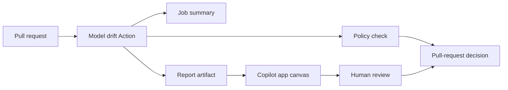

# Simulink Model Drift

Simulink Model Drift does two things:

| Part | Runs where | Purpose |
| --- | --- | --- |
| GitHub Action | Pull-request CI | Find changed models, compare base and head, evaluate policy, and publish deterministic reports |
| Copilot app canvas | Right side panel of a GitHub Copilot app session | Turn that report into an interactive model review before the pull request is approved |

The Action produces the evidence. The canvas reads the same JSON reports for
human review.



## 1. Analyze the pull request

The Action compares the pull request base and head commits. It discovers added,
modified, deleted, and renamed model files, runs the configured semantic
extractor, compares canonical model manifests, and applies repository rules.

Each run produces:

| File | Purpose |
| --- | --- |
| `model-drift-index.json` | Aggregate status and links to every changed model |
| `model-drift-summary.md` | Pull-request summary written to the Actions job |
| `model-drift.sarif` | Optional code-scanning findings |
| `models/*/model-drift.json` | Element-level drift for one model |
| `models/*/model-drift.md` | Human-readable report for one model |
| `models/*/model-drift.svg` | Portable visual summary |

`fail-on` controls the policy threshold. Reports are still uploaded when the
Action fails, so reviewers can see why the check was blocked.

## 2. Review the change in the Copilot app

A passing check tells you the rules were satisfied. It does not tell you whether
the model change is right. That judgment happens in the canvas.

The extension is committed at
`.github/extensions/simulink-model-diff-canvas/`, the Copilot app's project
scope, so cloning the repository is the whole installation. Open an agent
session in the repository and ask for it:

```text
Open the Simulink Model Diff canvas for build/model-drift/model-drift-index.json
```

The canvas opens in the app's right side panel beside the conversation and
orders the review the way engineers actually run it:

1. **Trust.** State whether extraction was complete, partial, unsupported, or
   failed, before anything else is presented.
2. **Scope.** List the changed models and draw only the blocks and connections
   the report explicitly records.
3. **Evidence.** Pair before and after values, filtered by category or model
   path.
4. **Decision.** Give a merge assessment derived from analysis status, policy
   status, and recorded drift.

Because it is an app canvas rather than a static file, the agent in the session
can drive it while you read. It can load another report, jump to a specific
model, or refresh after a new analysis run through the canvas capabilities
`load_report`, `select_model`, and `refresh`.

The canvas never opens the `.slx` file, calls the GitHub API, posts a review, or
changes a check result. Branch protection and the Action's policy result remain
authoritative.

See [the canvas guide](docs/copilot-canvas.md) for inputs, capabilities, and
troubleshooting.

## Adopt in one workflow

Copy [the minimal consumer workflow](examples/github-actions/canonical-pr.yml) into `.github/workflows/simulink-model-drift.yml`:

```yaml
name: Simulink model drift

on:
  pull_request:
    paths:
      - "**/*.slx"
      - "**/*.mdl"
      - "**/*.model.json"
      - "model-drift/rules/**"

permissions:
  contents: read
  security-events: write

jobs:
  model-drift:
    uses: samueltauil/simulink-model-diff/.github/workflows/pr-analysis.yml@v0.3.0
    with:
      rules: model-drift/rules/default-rules.yml
      fail-on: error
      upload-sarif: true
```

The reusable workflow:

1. checks out complete history with `fetch-depth: 0`;
2. derives the base and head SHAs from the pull request event;
3. runs the composite action on a GitHub-hosted runner;
4. writes the aggregate Markdown to `GITHUB_STEP_SUMMARY`;
5. uploads the complete report directory even when policy fails;
6. uploads SARIF in a separate least-privilege job only for trusted events.

Pin a reviewed release commit SHA when your supply-chain policy requires an immutable reference. The reusable workflow and composite action must come from the same release.

## Fork pull-request safety

The supported automatic trigger is `pull_request`, never `pull_request_target`.

- The analysis job has only `contents: read`.
- Checkout disables persisted credentials and fetches full history so both PR commits are available.
- Fork PRs receive no repository secrets.
- SARIF upload is skipped for fork PRs because their token cannot safely receive `security-events: write`.
- Reports still appear in the job summary and artifact for fork PRs.
- Automatic PR analysis runs only on a GitHub-hosted runner.

Do not route untrusted fork models to a self-hosted MATLAB runner. See [Security](docs/security.md) and [Runner setup](docs/runner-setup.md).

## Composite action

Use the composite action directly when the caller needs to own checkout, artifact retention, or other workflow behavior:

```yaml
- uses: actions/checkout@v7
  with:
    fetch-depth: 0
    persist-credentials: false

- id: drift
  uses: samueltauil/simulink-model-diff@v0.3.0
  with:
    include: |
      models/**/*.slx
      canonical/**/*.model.json
    rules: model-drift/rules/default-rules.yml
    output: build/model-drift
    fail-on: error
```

`base-ref` and `head-ref` default to `github.event.pull_request.base.sha` and `github.event.pull_request.head.sha`. Outside a PR event, pass both explicitly. The action requests no permissions, uploads nothing, and exposes deterministic report paths for caller-owned artifact or SARIF steps.

See [GitHub Actions integration](docs/github-actions.md) for every input, output, permission, and event boundary.

## Licensed `.slx` extraction boundary

The public PR workflow does not include MATLAB or Simulink. A semantic extractor may require licensed MathWorks products, proprietary dependencies, and model-controlled execution such as callbacks or custom code.

Use [the licensed runner example](examples/github-actions/licensed-slx.yml) only as a manually dispatched, environment-approved workflow on an ephemeral, dedicated runner. It must not run automatically for fork PRs and must not hold deployment credentials. The checked-in extractor is a best-effort adapter and has not been qualified across MATLAB/Simulink releases in this repository.

## PR command contract

The action is a distribution wrapper around:

```bash
simulink-model-drift pr \
  --base-ref <sha> \
  --head-ref <sha> \
  --rules model-drift/rules/default-rules.yml \
  --output build/model-drift \
  --include "models/**/*.slx" \
  --fail-on error
```

Add `--include` for each model glob and `--extractor-command "..."` when a reviewed extractor is available. The command compares repository state at the two refs; it does not require callers to prepare explicit file pairs.

## Lower-level canonical and CLI interfaces

Canonical JSON is the portable semantic contract beneath PR analysis. It is useful for license-free CI, deterministic fixtures, and integrations that produce manifests outside GitHub.

```bash
simulink-model-drift analyze \
  --base examples/canonical/controller-base.model.json \
  --target examples/canonical/controller-target.model.json \
  --rules examples/rules/default-rules.yml \
  --output build/model-drift \
  --fail-on none
```

The lower-level `analyze`, `compare`, `validate`, `doctor`, `schema`, and `fingerprint` commands are documented in [the CLI guide](docs/cli.md). Pair-oriented output names and contracts belong to those interfaces; PR analysis uses the aggregate files listed above.

## Real-world sample models

The [`samples/`](samples/) directory includes a richer cardiac digital twin
scenario based on the public
[`samueltauil/cardiac-digital-twin`](https://github.com/samueltauil/cardiac-digital-twin)
project. It includes the reproducible MATLAB builder sources and canonical
baseline/target snapshots for the documented 50 mg → 60 mg beta-blocker
scenario. The sample is intentionally marked `partial` until a licensed
Simulink extractor qualifies the generated `.slx` artifact.

Open the sample directly in the canvas:

```text
Open the Simulink Model Diff canvas for samples/cardiac-digital-twin/drift.json
```

## Simulink `.slx` format basics

Official MathWorks guidance describes the `.slx` file as a ZIP-based Open Packaging Convention (OPC) package, not as a single XML document. The package typically contains a root `[Content_Types].xml` manifest plus model and metadata members such as `simulink/blockdiagram.xml`, `simulink/configSetInfo.xml`, `simulink/stateflow.xml`, and `metadata/mwcoreProperties.xml`.

`simulink-model-drift inspect-slx <artifact>` validates that this package structure is present and emits an inventory without claiming semantic extraction. This is intentionally a bounded safety check: the file may be a valid Simulink package while still needing an approved MATLAB/Simulink extractor to produce a trustworthy canonical manifest.

## Capability boundaries

- Structural drift is not proof of behavioral equivalence.
- Raw SLX package inspection is bounded diagnostics, not semantic extraction.
- Complete semantic analysis requires a supported extractor and an explicit `analysis.status`.
- Partial, unsupported, or failed extraction remains visible and cannot become a clean “no drift” result.
- Rename and move detection may conservatively appear as removal plus addition.
- SARIF locations for model elements are less precise than source-code line annotations.

## Project status and release policy

The comparison engine, reporters, Action, reusable workflow, and canvas are
implemented. The Action contract is documented under `Unreleased`; release the
Action and reusable workflow together as `v0.3.0` before external adoption.
Consumers should pin an exact release or reviewed commit SHA.

See [Getting started](docs/getting-started.md), [GitHub Actions integration](docs/github-actions.md), [Copilot app canvas](docs/copilot-canvas.md), [Architecture](docs/architecture.md), [Security](docs/security.md), [CHANGELOG.md](CHANGELOG.md), and [ROADMAP.md](ROADMAP.md).

## License

Released under the [MIT License](LICENSE). MATLAB and Simulink are separate MathWorks products and are not included.
