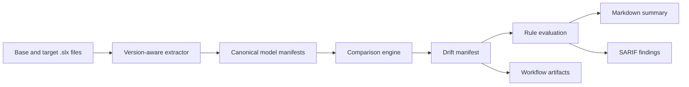

# Simulink Model Drift Analyzer

Simulink Model Drift Analyzer is a GitHub-native MVP for reviewing meaningful changes represented by canonical Simulink model manifests. It validates canonical JSON, compares base and target models, evaluates policy rules, and emits deterministic drift JSON, Markdown, SARIF, and SVG evidence.

The core value is separation of concerns:

- **Canonical manifests** describe each model in a stable, machine-readable form.
- **Drift manifests** describe every detected change, including informational changes.
- **Rules** decide which changes require action.
- **Markdown, artifacts, and SARIF** present the same result to different audiences.

> [!IMPORTANT]
> This repository does not claim MATLAB or Simulink semantic extraction. The implemented CLI compares canonical model JSON. A production `.slx` extractor should use supported MathWorks APIs or official comparison results and must report `partial`, `unsupported`, or `failed` when analysis is incomplete. The `inspect-slx` command provides bounded ZIP/OPC diagnostics only.

## How it fits together



Canonical and drift JSON are the system of record. SARIF is only an adapter for actionable, rule-driven findings.

## Install

The shared contracts and reporting package requires Python 3.11 or newer. Install
the project for development with:

```bash
python -m venv .venv
# Windows PowerShell: .venv\Scripts\Activate.ps1
# Linux/macOS: source .venv/bin/activate
python -m pip install --upgrade pip
python -m pip install -e ".[test]"
```

Do not interpret a successful installation as proof that MATLAB/Simulink extraction is available. That capability also requires a supported implementation, compatible MathWorks products, licensing, and an intentionally isolated execution environment.

## Semantic extractor boundary

`model_drift.extract.SemanticExtractor` is the integration contract for a
supported MATLAB/Simulink adapter. `AdapterExtractor` wraps an in-process
adapter, while `ExternalCommandExtractor` runs a configured command without a
shell. The command writes one canonical manifest JSON object to stdout and may
use `{artifact}` as a path placeholder; otherwise the artifact path is
appended as the final argument.

The boundary is fail-closed: the result must explicitly report
`analysis.status`, pass the canonical schema and canonicalization checks, and
carry a SHA-256 matching the supplied artifact. A `complete` result cannot
report unsupported features. No extractor in this package interprets
undocumented SLX XML, and package inventory diagnostics remain
`partial`/`unsupported` rather than semantic extraction.

## Quickstart

The checked-in examples are generated by the real CLI and let you exercise the complete comparison path without MATLAB:

```text
examples/canonical/controller-base.model.json
examples/canonical/controller-target.model.json
        |
        v
examples/output/controller.drift.json
        |
        +--> examples/rules/default-rules.yml
        +--> examples/output/controller-summary.md
        +--> examples/output/controller.sarif
```

Compare the canonical examples and generate all reports:

```bash
simulink-model-drift compare \
  --base examples/canonical/controller-base.model.json \
  --target examples/canonical/controller-target.model.json \
  --rules examples/rules/default-rules.yml \
  --output build/model-drift \
  --fail-on none
```

The fixture intentionally contains an added Saturation block, a changed Gain, and a top-level input data-type change. `--fail-on none` keeps example generation successful even though the configured interface rule produces an error finding. Omit that option in enforcement workflows; the default is `--fail-on error`.

For real engineering workflows, use the end-to-end analyzer to compare `.slx` files or canonical JSON directly:

```bash
SIMULINK_DIFF_COMMAND='python tools/extract_model.py {artifact}' \
simulink-model-drift analyze \
  --base models/controller-v1.slx \
  --target models/controller-v2.slx \
  --rules model-drift/rules/default-rules.yml \
  --output build/model-drift \
  --fail-on error
```

The command accepts either canonical JSON inputs or `.slx` artifacts. When `.slx` files are supplied, the extractor must emit a canonical manifest JSON object on stdout and report `analysis.status` explicitly. This is the production integration boundary for a supported MathWorks-backed implementation.

Validate contracts, inspect a malformed or unsupported SLX package, print schema locations, or calculate a stable JSON fingerprint:

```bash
simulink-model-drift validate canonical examples/canonical/controller-base.model.json
simulink-model-drift validate drift build/model-drift/model-drift.json
simulink-model-drift inspect-slx models/controller.slx --output build/slx-diagnostics.json
simulink-model-drift schema canonical
simulink-model-drift fingerprint examples/canonical/controller-base.model.json
```

Comparison outputs are:

- `model-drift.json`: schema-validated factual change record.
- `model-drift.md`: reviewer-friendly summary.
- `model-drift.sarif`: policy violations suitable for code scanning.
- `model-drift.svg`: dependency-free visual evidence suitable for artifacts and documentation.


Exit code `3` means the configured policy threshold was reached. Exit code `4` means comparison output was generated but analysis was incomplete. `inspect-slx` returns exit code `1` for partial, unsupported, or failed package inspection because it cannot establish semantic completeness. Invalid JSON, schemas, or rules return exit code `2`.

## GitHub Actions

`.github/workflows/simulink-model-drift.yml`:

- installs the project without changing package metadata;
- runs the full repository test suite and package build;
- validates both canonical examples;
- regenerates JSON, Markdown, SARIF, and SVG through the implemented CLI;
- validates the generated drift manifest;
- runs the configured production analyzer when an `.slx` file changes;
- always writes a job summary and uploads diagnostic/output artifacts;
- uploads SARIF only when a SARIF file exists and the event has safe permissions;
- avoids granting pull-request write access or exposing secrets to forked pull requests.

Set the repository variable `SIMULINK_DIFF_COMMAND` to the complete production extraction-and-comparison command when analyzing changed `.slx` files. The command must write non-empty JSON, Markdown, SARIF, and SVG reports to `build/model-drift`; the workflow validates the JSON drift contract before preserving the command's exit status. If an `.slx` file changes and this variable is empty, the workflow fails rather than treating the model as analyzed. MATLAB-based extraction generally needs a licensed, isolated runner; the default GitHub-hosted runner does not imply that capability.

## Current limitations

- No MATLAB/Simulink semantic extractor is documented as implemented.
- The example manifests are controlled canonical fixtures, not results produced by parsing included `.slx` files.
- Behavioral equivalence, MIL/SIL/PIL execution, generated-code comparison, automatic merging, and complete Stateflow coverage are out of scope for the first prototype.
- Path-based element identity can represent a rename or move as a removal plus an addition.
- An `.slx` element has no natural source line. SARIF can point to the model file and use logical locations, but GitHub annotations may be less precise than source-code findings.
- GitHub code-scanning availability and SARIF permissions depend on repository settings and event type. JSON, Markdown, and workflow artifacts remain the portable outputs.
- Cross-release compatibility must be demonstrated with fixtures; it must not be assumed.

See [Architecture](docs/architecture.md) and [Security](docs/security.md) for the design boundaries and threat model. The longer rationale is in [`context/reference.md`](context/reference.md).

## Project status

The canonical-manifest comparison MVP is implemented and integration-tested. Semantic `.slx` extraction remains a separate future track that requires supported MathWorks APIs, licensing, release compatibility evidence, and an isolated runner.
