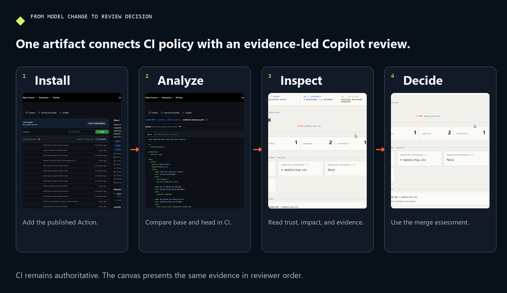

# Simulink Model Drift

Review Simulink model changes in pull requests with deterministic evidence,
policy checks, and an interactive GitHub Copilot app canvas.

[](https://github.com/samueltauil/simulink-model-diff/actions/workflows/simulink-model-drift.yml)
[](https://github.com/samueltauil/simulink-model-diff/releases/latest)
[](LICENSE)
[](pyproject.toml)

Binary `.slx` and `.mdl` files do not produce a useful source diff. This
project finds the models changed by a pull request, compares the base and head
versions, applies repository policy, and builds a reviewer queue from the
result.

<p align="center">
  
</p>

## What you get

| Surface | Purpose |
| --- | --- |
| GitHub Action | Discover changed models, map affected dependents, combine review evidence, evaluate policy, and publish a prioritized job summary |
| Report contract | Stable aggregate and per-model JSON, Markdown, SVG, and SARIF |
| Copilot app canvas | Review trust, repository impact, tests, quality findings, before and after evidence, and the merge assessment beside the agent conversation |

The Action produces the evidence. The canvas reads the same JSON. Branch
protection and repository policy remain authoritative.

Read the [end-to-end review guide](docs/end-to-end-review.md) for the complete
setup and reviewer path.

## Add it to a repository

Create `.github/workflows/simulink-model-drift.yml`:

```yaml
name: Simulink model drift

on:
  pull_request:
    paths:
      - "**/*.slx"
      - "**/*.mdl"
      - "**/*.model.json"

permissions:
  contents: read

jobs:
  model-drift:
    runs-on: ubuntu-latest
    timeout-minutes: 30
    steps:
      - name: Check out pull request history
        uses: actions/checkout@v7
        with:
          fetch-depth: 0
          persist-credentials: false

      - name: Analyze model drift
        id: drift
        uses: samueltauil/simulink-model-diff@v0.5.0
        with:
          fail-on: error

      - name: Upload reports
        if: always()
        uses: actions/upload-artifact@v7
        with:
          name: simulink-model-drift-${{ github.run_id }}
          path: build/model-drift
          if-no-files-found: warn
          retention-days: 14
```

The checkout must contain full history so the analyzer can read both pull
request commits. The Action requests no permissions and does not upload
artifacts or SARIF by itself.

Use the [complete workflow sample](samples/github-actions/canonical-pr.yml) when
you need custom model globs or policy rules. The
[GitHub Actions guide](docs/github-actions.md) also covers the optional reusable
workflow and SARIF upload.

## Read the result

The job summary puts the models in review order:

| Priority | Meaning |
| --- | --- |
| `blocked` | Analysis failed, evidence is incomplete, or policy failed |
| `high` | Interface or functional drift needs focused review |
| `normal` | Other semantic drift was recorded |
| `low` | No semantic drift was recorded |

The Action exposes the aggregate result as `review-status` with one of three
values: `blocked`, `review-required`, or `clear`.

The aggregate index also records repository relationships and imported
evidence. The bundled scanner uses MathWorks `data-explorer-core` to find model
references, dictionaries, and external data sources without starting MATLAB.
This is structural context only. It does not turn partial semantic extraction
into a complete result.

Repositories can also provide SARIF quality reports and JUnit test results.
Errors, failed tests, and missing required evidence block review. Warnings keep
the result at `review-required`.

The artifact contains:

| File | Contents |
| --- | --- |
| `model-drift-index.json` | Aggregate status, review plan, and links to each model |
| `model-drift-summary.md` | The same prioritized plan shown in the job summary |
| `model-drift.sarif` | Optional code-scanning findings |
| `models/*/model-drift.json` | Element-level evidence for one model |
| `models/*/model-drift.md` | Human-readable model report |
| `models/*/model-drift.svg` | Portable visual summary |

Reports are preserved when analysis or policy fails. A blocked check still
gives the reviewer the evidence needed to fix it.

## Review it in the Copilot app

The canvas extension and the Action are installed separately. To add the
canvas to another repository, copy
`.github/extensions/simulink-model-diff-canvas/` into that repository. Open the
repository in the GitHub Copilot app, download the workflow artifact to
`build/model-drift`, then ask:

```text
Open the Simulink Model Diff canvas for build/model-drift/model-drift-index.json
```

The canvas starts with extraction trust, orders changed models by reviewer
priority, shows recorded before and after values, and ends with a merge
assessment. It does not open the `.slx` file, post a review, or change the
Action result.

<p align="center">
  <a href="docs/assets/copilot-canvas-demo.mp4">
    
  </a>
</p>

The recording uses real public GitHub pages and a real impact-aware GitHub
Copilot app canvas. See the
[end-to-end review guide](docs/end-to-end-review.md) for the workflow and the
[canvas guide](docs/copilot-canvas.md) for installation and troubleshooting.

## Trust and licensed extraction

Automatic pull request analysis runs on a GitHub-hosted runner with
`contents: read`, no secrets, and no persisted checkout credentials. Use
`pull_request`, never `pull_request_target`, for untrusted changes.

The relationship scanner reads saved package bytes and does not execute model
callbacks, project startup files, MATLAB code, or repository scripts.

Loading a model in MATLAB or Simulink can execute callbacks, scripts, custom
code, and referenced dependencies. Licensed extraction belongs in a separate,
approved workflow on a disposable runner. Partial, unsupported, and failed
evidence stays visible and cannot become a clean result.

Read [Security](docs/security.md) and
[Runner setup](docs/runner-setup.md) before enabling licensed extraction.

## Compared with the MathWorks example

The
[MathWorks pull-request example](https://github.com/mathworks/Simulink-Model-Comparison-for-GitHub-Pull-Requests)
uses the licensed Simulink Comparison Tool to publish official `visdiff` HTML
reports. This project handles the surrounding GitHub review workflow: exact
base and head analysis, structured evidence, policy, SARIF, trust states,
reviewer prioritization, and the Copilot canvas.

The two approaches are complementary. A supported MathWorks-backed extractor
can provide qualified semantic evidence to this project's report contract.
Read the [detailed comparison](docs/comparison-with-mathworks.md).

## Documentation

Start with the [documentation index](docs/README.md).

| Guide | Use it for |
| --- | --- |
| [End-to-end review](docs/end-to-end-review.md) | Complete pull request workflow, benefits, and differentiators |
| [Getting started](docs/getting-started.md) | First Action run and first canvas review |
| [GitHub Actions](docs/github-actions.md) | Inputs, outputs, reusable workflow, and SARIF |
| [Copilot app canvas](docs/copilot-canvas.md) | Installation, review workflow, and troubleshooting |
| [Architecture](docs/architecture.md) | Data flow, report contracts, and trust boundaries |
| [Security](docs/security.md) | Fork safety, permissions, and model execution risks |
| [CLI reference](docs/cli.md) | Local automation and diagnostics |

## Development

```bash
python -m pip install -e ".[test]"
python -m pytest
python -m ruff check .
python -m build
```

See [CONTRIBUTING.md](CONTRIBUTING.md) for repository conventions and
[CHANGELOG.md](CHANGELOG.md) for release history.

## License

Released under the [MIT License](LICENSE). MATLAB and Simulink are separate
MathWorks products and are not included.
