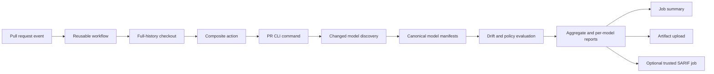

# Architecture

## PR-native product boundary

The reusable workflow is the recommended product entry point. It owns event-safe checkout, artifact retention, and SARIF permissions. The composite action is a permission-free adapter around the public `simulink-model-drift pr` command. The Python package owns discovery, extraction, comparison, policy, and reporting.

## Permission separation

The analysis job needs only `contents: read`. The composite action cannot and should not own repository permissions. SARIF upload runs in a separate job with `security-events: write`, downloads the already generated artifact, and is disabled for fork PRs.

This separation preserves useful reports when code scanning is unavailable and prevents the model-analysis process from receiving write credentials.

## Repository comparison

The PR command accepts base and head refs plus one or more include globs. It resolves changed models from Git history, obtains the relevant base/head artifacts, and creates a per-model analysis plan. Callers do not prepare explicit pairs.

The output directory contains:

- a deterministic aggregate JSON index;
- an aggregate Markdown review;
- aggregate SARIF findings;
- deterministic per-model reports.

## Semantic boundary

Canonical manifests remain the semantic contract. `.slx` or `.mdl` analysis requires an extractor that emits a valid canonical manifest with explicit analysis status and source digest. Supported Simulink APIs or documented comparison evidence are preferred; undocumented SLX XML is not a semantic API.

Only `complete` analysis supports a clean “no drift” conclusion. `partial`, `unsupported`, and `failed` states remain visible in aggregate and per-model reports.

## Lower-level interfaces

`analyze` and `compare` remain useful for explicit canonical pairs, testing, and non-GitHub integrations. They are implementation-level interfaces beneath the PR product rather than the primary onboarding path.
