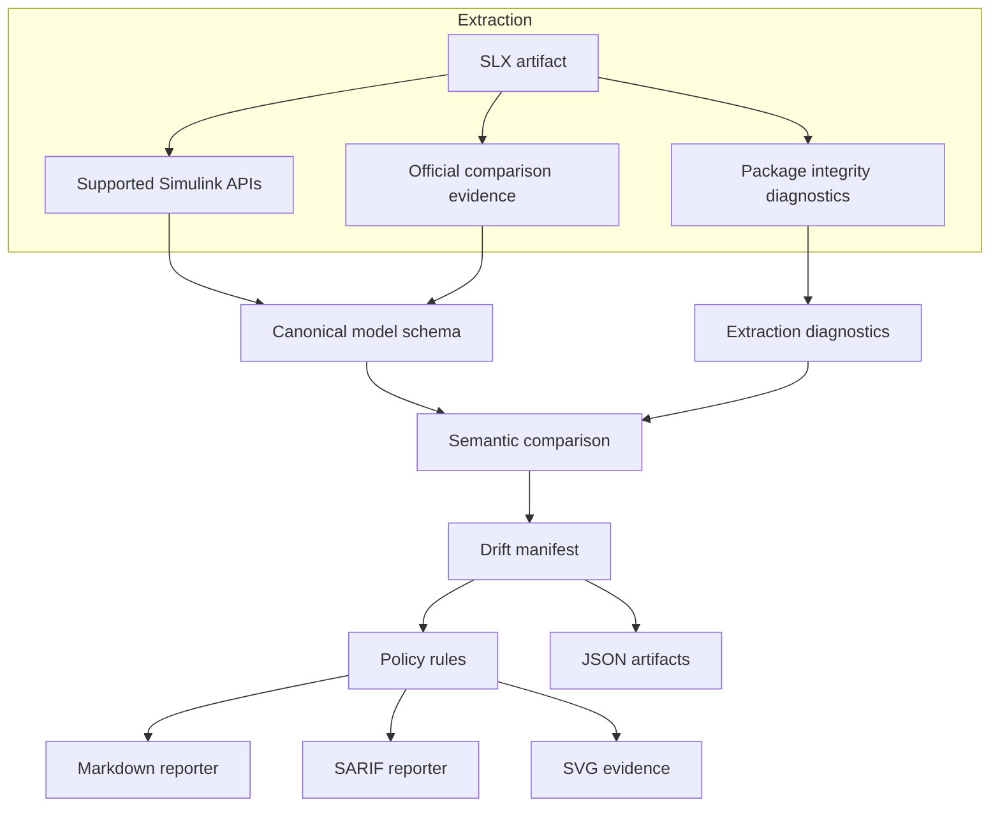
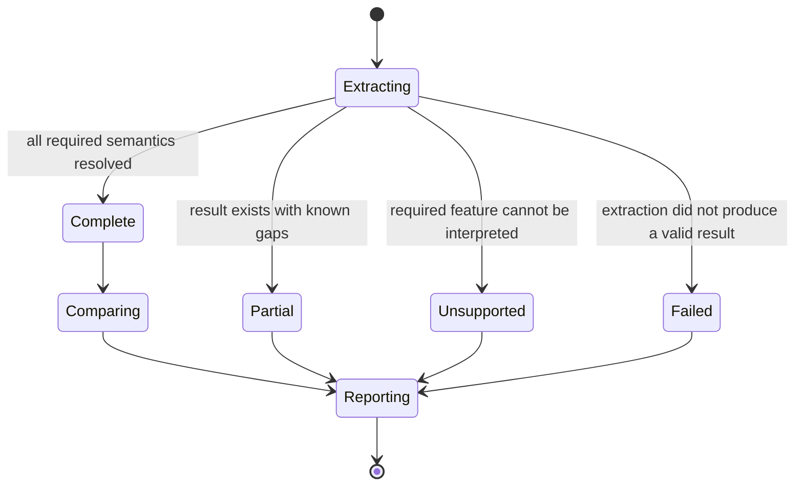

# Architecture

## Design goals

The analyzer should make Simulink changes reviewable without coupling its public contracts to undocumented SLX package internals. Its outputs must be deterministic, versioned, explicit about incomplete analysis, and useful outside GitHub.

Supported Simulink APIs are the preferred semantic source. Official comparison output may provide supporting evidence. Raw SLX package inspection is limited to integrity, inventory, and diagnostics; it must not silently stand in for semantic interpretation.

The code-level semantic boundary is `SemanticExtractor`. A supported
in-process implementation can be wrapped with `AdapterExtractor`, or an
isolated trusted runner can be invoked with `ExternalCommandExtractor`. Both
must return a canonical manifest with an explicit `analysis.status`; the
boundary validates the manifest and source artifact hash before accepting it.
External commands use argument vectors, not a shell, and have bounded stdout,
stderr, and execution time. The command or adapter is responsible for
semantic interpretation; this package never infers it from undocumented XML.

## Stable contracts

### Canonical model manifest

A canonical manifest represents concepts such as models, systems, blocks, ports, interfaces, connections, parameters, references, and Stateflow elements. It also records generator information, source hashes, extraction status, warnings, and unsupported features.

Determinism requires:

- stable collection ordering and JSON serialization;
- repository-relative, normalized paths;
- normalized scalar values;
- exclusion of timestamps and temporary paths;
- explicit unavailable values;
- stable schema and fingerprint versions.

### Drift manifest

The drift manifest is the complete factual record of additions, removals, modifications, moves, reconnections, and unresolved or unsupported comparisons. It preserves before/after evidence and analysis status. Informational drift remains in this manifest even when no policy rule matches.

### Rule findings

Rules operate on drift facts. They carry stable IDs, categories, levels, and explicit match criteria. The first implementation should favor transparent rules over an opaque aggregate risk score.

### Reporters

Markdown summarizes the result for reviewers. SARIF contains only actionable findings and incomplete-analysis failures. The deterministic SVG is a lightweight visual artifact generated from the same summary and findings. SARIF is not the semantic database and should never be required to consume the complete model diff.

## Analysis state

Only `complete` analysis may support a clean "no drift" conclusion. `partial`, `unsupported`, and `failed` must remain visible in manifests, summaries, workflow conclusions, and, when configured, analysis findings.

## Identity and matching

Normalized model paths are a reasonable MVP identity but are unstable across rename and move operations. Matching may later combine supported persistent identifiers, path, block type, parent, port signature, neighboring connections, and selected parameters. Uncertain matches should expose their strategy and confidence; otherwise report a conservative removal plus addition.

## Validation boundaries

Generated canonical and drift files should be checked against versioned JSON Schemas. SARIF must satisfy both SARIF 2.1.0 and GitHub's supported subset. Golden fixtures should isolate one change type, while determinism tests extract and serialize the same model twice and compare bytes and hashes.

Compatibility is evidence-based: record the model's saved release, extractor release, load result, schema version, warnings, and expected drift result for every supported combination.
