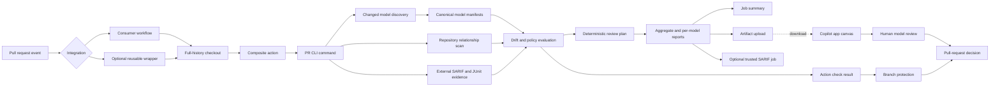

# Architecture

[Documentation index](README.md) | [Project README](../README.md)

## Action and review flow

The primary integration is the published Action inside a consumer-owned
workflow. The optional reusable wrapper owns checkout, artifact retention, and
SARIF permissions for teams that prefer a job-level call. Both paths reach the
same composite Action, which wraps `simulink-model-drift pr` without requesting
repository permissions. The Python package handles discovery, extraction,
comparison, policy, and reporting.

The bundled relationship scanner is a separate Node process built from
MathWorks `data-explorer-core`. It reads `.slx` and `.mdl` files from base and
head snapshots and returns model references, linked dictionaries, and external
data sources. Python validates that output, resolves repository paths, detects
cycles and missing targets, and computes reverse impact.

External SARIF and JUnit files are caller-owned inputs. The analyzer normalizes
their tool identity, outcomes, and model mapping into the aggregate review
contract. It never runs the tools that produced those files.

The Action check and the canvas have separate jobs. The Action enforces the
configured policy in CI. The canvas is a GitHub Copilot app extension that
reads the generated report afterwards and helps a reviewer inspect the
evidence. It cannot alter the check or approve the pull request. See
[the canvas guide](copilot-canvas.md).

## Permission separation

The analysis job needs only `contents: read`. The composite Action does not own
repository permissions. SARIF upload runs in a separate job with
`security-events: write`, downloads the generated artifact, and is disabled for
fork PRs.

This separation preserves reports when code scanning is unavailable and keeps
write credentials away from model analysis.

## Repository comparison

The PR command accepts base and head refs plus one or more include globs. It
resolves changed models from Git history, obtains the relevant base and head
artifacts, and creates a per-model analysis plan. Callers do not prepare
explicit pairs.

The output directory contains:

| Output | Consumer |
| --- | --- |
| Aggregate JSON index | Copilot app canvas and other integrations |
| Aggregate Markdown | GitHub Actions job summary |
| Aggregate SARIF | Optional code-scanning upload |
| Per-model JSON, Markdown, SARIF, and SVG | Review artifact |

The JSON files form the handoff between automated analysis and local review.
The canvas does not need the original `.slx` file to render an existing report.

The aggregate index also contains a `reviewPlan`. It ranks failed or incomplete
analysis and policy failures ahead of interface, functional, and structural
drift. The same order appears in the job summary and the canvas model queue.
This is reviewer prioritization, not another policy gate; the underlying
analysis status and policy findings remain authoritative.

Schema version `0.2.0` adds `repositoryContext`, `externalEvidence`, and
per-model `impact` and `externalEvidence` records. Imported errors, failed
tests, and missing required evidence block review. Imported warnings require
review. None of those records can raise semantic extraction trust.

## Semantic boundary

Canonical manifests remain the semantic contract. `.slx` or `.mdl` analysis
requires an extractor that emits a valid canonical manifest with explicit
analysis status and a source digest. Supported Simulink APIs or documented
comparison evidence are preferred. Undocumented SLX XML is not a semantic API.

Only `complete` analysis supports a clean "no drift" conclusion. `partial`,
`unsupported`, and `failed` states remain visible in aggregate and per-model
reports. The canvas carries the same status into its merge assessment instead
of treating incomplete evidence as a clean result.

Repository relationships are labeled `structural-non-semantic`. They establish
review scope and affected dependents, but they do not prove behavioral
equivalence or semantic completeness.

## Lower-level interfaces

`analyze` and `compare` remain useful for explicit canonical pairs, testing, and non-GitHub integrations. They are implementation-level interfaces beneath the PR product rather than the primary onboarding path.
