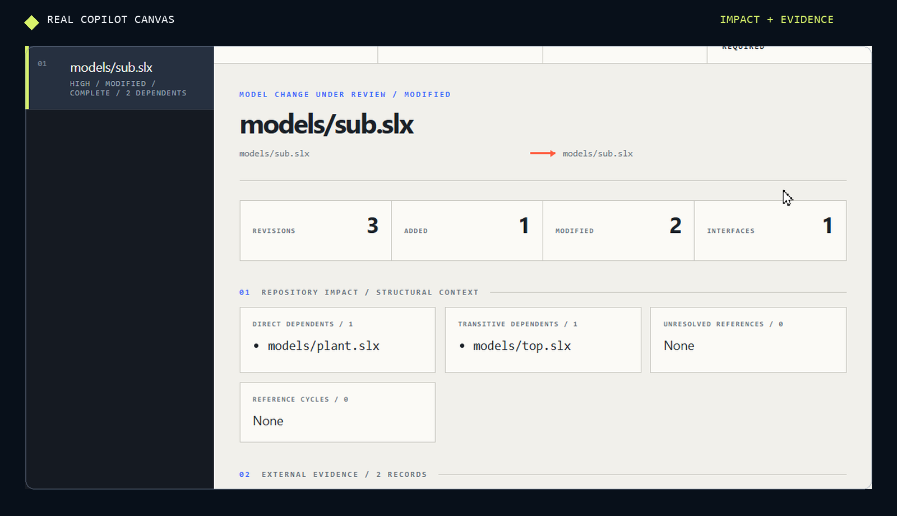
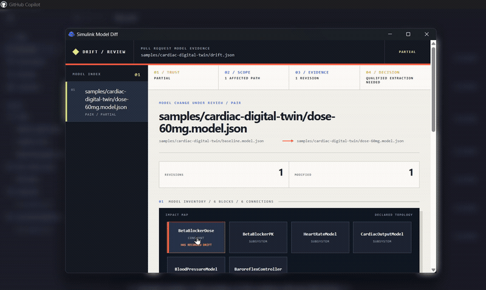

# Copilot app review canvas

The canvas is the human half of this project. The GitHub Action decides whether
a pull request passes policy. The canvas is where an engineer decides whether
the model change is correct.

It runs in the [GitHub Copilot app](https://docs.github.com/en/copilot/how-tos/github-copilot-app/working-with-canvas-extensions)
as a canvas extension, not in a browser tab and not in the CLI. When opened, it
occupies the app's right side panel next to the agent conversation, so the
report stays visible while you keep asking questions about the change.

## Why a canvas instead of a report file

A drift report is a JSON tree with nested elements, statuses, and before/after
values. Reading it as raw text or as a flat Markdown table makes two mistakes
easy: missing that the extraction was incomplete, and missing which of many
changes actually matters.

The canvas keeps both facts in view. It leads with analysis completeness, then
shows scope, then evidence, and only then offers a merge assessment.

## Review in 30 seconds

This is the shortcut that makes the canvas useful in a pull request review:

1. Open the canvas from the GitHub Copilot app.
2. Confirm the extraction status. If it is `partial`, `unsupported`, or
   `failed`, the review stops there.
3. Check the model queue to see which blocks changed.
4. Inspect the evidence map for before/after values and the categories that
   changed.
5. Use the decision card to confirm whether the change is ready for human
   review or needs a stronger extraction first.

<p align="center">
  
</p>

This is the practical benefit. You are not reading a JSON dump. You are looking
at a review workflow designed around trust, scope, evidence, and decision.

## PR review demo

<p align="center">
  <a href="assets/copilot-canvas-demo.mp4">
    
  </a>
</p>

The 13-second preview is a screen recording of the Windows GitHub Copilot app
running the project canvas with the checked-in cardiac digital twin report. It
shows the real app window, canvas window, mouse interaction, scrolling, filters,
and merge assessment. No browser recreation, synthetic app frame, or generated
model view is used. The unrelated app background is blurred for privacy.

Select the preview to open the
[full-quality recording](assets/copilot-canvas-demo.mp4).

You can run the demo without creating a pull request or downloading a workflow
artifact. Open this repository in the Copilot app and send:

```text
Open the Simulink Model Diff canvas for samples/cardiac-digital-twin/drift.json
```

The checked-in report models a beta-blocker dose change from 50 mg to 60 mg.
Its extraction status is intentionally `partial`, so the demo shows how the
canvas handles useful but incomplete evidence rather than presenting a false
clean result.

1. Read the trust card first. The canvas reports `partial` and tells you the
   reviewer should not treat the report as clean approval.
2. Move to the model queue and find the affected path. The reviewer can see the
   exact model under change without opening the raw JSON.
3. Inspect the impact map. It shows the blocks and connections the report lists
   as changed, with no invented geometry or guesswork.
4. Open the evidence section and compare the before/after values for the
   changed parameter or block.
5. Confirm the decision card. In a partial report, the result is a qualified
   extraction needed; the analyst can ask the approved extractor to re-run and
   refresh the canvas.

Continue the demo from the agent conversation:

```text
The report is partial. Show me the model path that changed and explain why the extraction is not clean.
Focus on the dose parameter change and compare the before and after values.
Select the changed cardiac model in the canvas.
```

The value is not that the canvas creates a review decision by itself. The value
is that it turns a noisy artifact into a guided inspection. Trust, scope,
proof, and decision stay in the same view as the PR discussion.

For a real pull request, replace the sample path with the downloaded Action
artifact:

```text
Open the Simulink Model Diff canvas for build/model-drift/model-drift-index.json
```

## Install

The extension is committed to this repository at
`.github/extensions/simulink-model-diff-canvas/`, which is the Copilot app's
project scope. Anyone who clones the repository and opens an agent session in it
gets the canvas without installing anything. `@github/copilot-sdk` is resolved
by the app, so there is no build step and no `node_modules` directory.

To confirm it is available, open **Customize** in the app sidebar, click
**Canvas**, then **Installed**. The canvas appears as **Simulink Model Diff**.

If you changed the extension source, reload extensions in the app before
reopening the canvas.

## Open a report

Start an agent session in the repository, then ask for the canvas by name:

```text
Open the Simulink Model Diff canvas for build/model-drift/model-drift-index.json
```

`build/model-drift/model-drift-index.json` is the default path, so asking to
open the Simulink Model Diff canvas with no path works after a local run.

The canvas accepts three shapes of input:

| Input | When to use it |
| --- | --- |
| `model-drift-index.json` | A pull request that changed several models |
| `models/*/model-drift.json` | One model in detail |
| A canonical `*.model.json` snapshot | Inspecting a single extracted model |

To review CI output, download the workflow artifact into the checkout first.
See [Getting started](getting-started.md).

## The review sequence

The panel is ordered the way a model review actually happens.

**Trust.** The header states whether extraction was `complete`, `partial`,
`unsupported`, or `failed`. A partial report can still be worth reading, but it
cannot support a clean approval, and the canvas says so rather than rendering
the change as settled.

**Scope.** The model queue lists every changed model in the pull request. The
impact map draws only the blocks and connections the report explicitly records.
It does not infer a signal route from block ordering, so an empty area means the
report did not describe that part of the model.

**Evidence.** The ledger pairs before and after values for each recorded change.
Filters narrow it by functional, interface, or structural category, and path
focus limits it to one model path. Fields the report never populated are hidden
instead of being rendered as `unknown`.

**Decision.** The merge assessment combines analysis status, policy status, and
the recorded drift:

| Assessment | Meaning |
| --- | --- |
| Analysis unavailable | Extraction failed or the format is unsupported |
| Qualified extraction needed | Evidence is partial; run the approved extractor |
| Policy gate failed | The configured rules rejected the change |
| Reviewer decision required | Complete analysis with real drift to judge |
| No drift detected | Complete analysis with no recorded change |

## Working with the agent

Because the canvas is an app extension, the agent in the session can drive it
while you read. It exposes three capabilities:

| Capability | Effect |
| --- | --- |
| `load_report` | Swap in a different report, optionally selecting a model |
| `select_model` | Move the panel to another changed model |
| `refresh` | Re-read the report from disk after a new analysis run |

This is the practical difference from a static report. You can ask the agent to
rerun the analysis and refresh the panel, or to jump to the model a reviewer
asked about, without leaving the conversation or rebuilding your place in the
review.

## Boundaries

The canvas reads JSON that the analyzer already produced. It does not:

- open, parse, or execute the `.slx` file;
- reproduce the Simulink editor or render model geometry;
- call the GitHub API, post a review, or change a check result;
- approve a pull request or override branch protection.

The merge assessment is review guidance. The Action's policy result and the
repository's branch protection rules remain authoritative.

## Security

Report paths are resolved against the active workspace and rejected if they
escape it. Files must be JSON and no larger than 64 MiB. The renderer listens on
an ephemeral loopback port, serves one canvas instance per session, and sets a
restrictive content security policy. See [Security](security.md).

## Troubleshooting

| Symptom | Cause and fix |
| --- | --- |
| Canvas is missing from the catalog | Reload extensions, and confirm the session opened in this repository |
| "Report path must remain inside the active workspace" | The path escaped the repository root; copy the report into the checkout |
| Panel shows no connections | The report recorded no explicit connections; this is honest output, not a rendering failure |
| Every field reads as unavailable | The report is `failed` or `unsupported`; fix extraction first |
