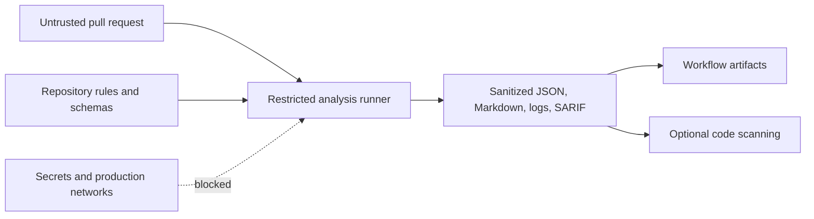

# Security

Simulink models are potentially active, untrusted inputs. Loading a model can involve callbacks, initialization scripts, custom code, referenced models, libraries, data dictionaries, or product-specific behavior. A pull request from a fork must be treated as untrusted even when the repository itself is trusted.

## Trust boundaries



## Required controls

- Run model extraction in an isolated, disposable environment with minimum credentials.
- Do not make secrets available to model analysis for forked pull requests.
- Restrict outbound network access when practical.
- Explicitly control whether model callbacks, initialization scripts, custom code, and dependency resolution execute.
- Resolve only expected repository-relative inputs; reject traversal and unsafe output paths.
- Bound archive expansion, file count, model size, recursion depth, execution time, and generated output size.
- Run external semantic extractors through an argument vector with no shell,
  bounded stdout/stderr, a timeout, and an isolated working directory.
- Treat model names, paths, parameters, logs, and rule messages as untrusted when rendering Markdown, HTML, or SARIF.
- Record unresolved dependencies and unsupported content. Never convert an extraction error into an empty successful result.
- Keep third-party actions and dependencies reviewed and pinned according to repository policy.
- Retain sufficient diagnostics to reproduce failures without publishing secrets or proprietary model content unnecessarily.

## GitHub Actions permissions

The checked-in workflow grants only:

```yaml
permissions:
  contents: read
  security-events: write
```

It does not request pull-request write permission. SARIF upload is conditional because `security-events: write` is generally unavailable to workflows triggered by untrusted fork pull requests. Artifacts and the job summary remain available when SARIF cannot be uploaded.

If comments or check-run annotations are added later, put them in a separate, carefully designed workflow rather than broadening the analyzer's permissions. Do not use `pull_request_target` to check out and execute untrusted pull-request code.

## MATLAB runner guidance

A MATLAB/Simulink runner may require licenses and access to proprietary dependencies. Prefer a dedicated ephemeral runner pool with no persistent workspace. Start from a deny-by-default callback and dependency policy, then enable only behavior required for a validated fixture set. If callbacks cannot be disabled without invalidating analysis, document that fact and raise the isolation level rather than silently executing them.

## Output and supply-chain integrity

- Hash source artifacts and include the digest in canonical manifests.
- Produce deterministic output so unexpected changes are reviewable.
- Normalize repository-relative SARIF paths and keep rule IDs and fingerprints stable.
- Validate schemas before upload.
- Upload SARIF only after analysis and validation succeed.
- Do not place commit SHAs, run IDs, timestamps, or temporary paths in stable fingerprints.
- Pin production action versions to reviewed commit SHAs when the repository's dependency policy requires immutable references.

## Failure policy

Security-relevant uncertainty is an analysis result, not a warning to discard. Extraction states `partial`, `unsupported`, and `failed` should fail the workflow or require an explicit policy decision. Logs should identify missing products, references, callbacks, or unsupported elements without claiming semantic equivalence.
